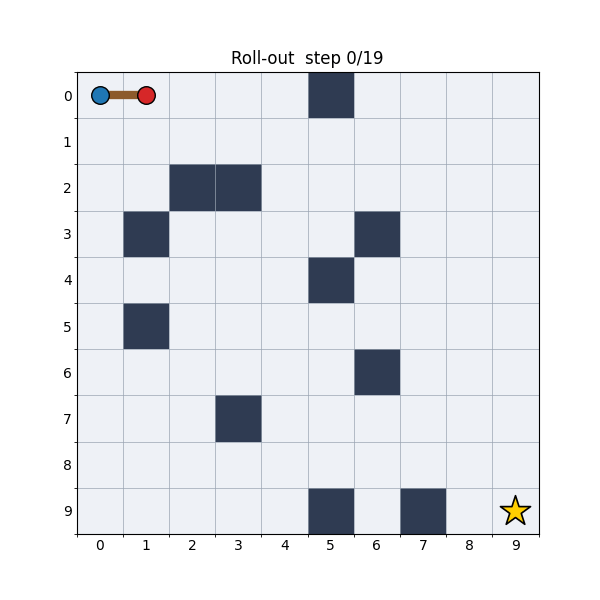

# A Value-Iteration Approach to the Multi-Robot Stick-Carrying Problem in Stochastic Environments

Two robots rigidly hold the two ends of a stick and must **cooperatively carry
it** across a grid world full of obstacles to a goal cell. The world is
*stochastic*: an intended manoeuvre only succeeds with probability `p_main`,
otherwise the imperfectly-coordinated robots *slip* and the stick translates in
a random direction. We model the task as a Markov Decision Process (MDP) and
solve it for an optimal policy with **value iteration**.




## Problem formulation

| Element | Definition |
| --- | --- |
| **State** | `StickState(row, col, orientation)` — robot A's cell plus the orientation (`HORIZONTAL` ⇒ robot B one cell right, `VERTICAL` ⇒ one cell below). Both occupied cells must be free. |
| **Actions** | `up, down, left, right` (translate the stick) and `rotate` (pivot about robot A). |
| **Transitions** | With probability `p_main = 0.8` the chosen action happens; with `0.2` the stick translates in a uniformly random direction. A move into an obstacle/wall leaves the stick in place. |
| **Reward** | `+100` for reaching the goal, `-1` per step (encouraging short paths). |
| **Discount** | `γ = 0.95`. |

## Project layout

```text
stick_carrying/
├── mdp.py            # abstract, generic MDP base class (ABC) + reachability search
├── stick_world.py    # StickState, GridWorld, StickCarryingMDP(MDP[StickState, Action])
├── solver.py         # Solver (ABC), ValueIterationSolver, Policy, Simulator
└── visualization.py  # StickVisualizer + dashboard()
main.py               # end-to-end driver: build → solve → simulate → save figures
1.ipynb               # thin notebook demo that imports the package
```

The design is object-oriented around an abstract `MDP` base class, so the
value-iteration solver is completely domain-agnostic — any MDP that enumerates
its states/actions and exposes a transition model can be plugged in.

## Usage

```bash
python main.py        # writes outputs/dashboard.png, trajectory.png, rollout.gif
```

```python
import numpy as np
from stick_carrying import (StickCarryingMDP, StickState, Orientation,
                            ValueIterationSolver, Simulator, StickVisualizer)

mdp = StickCarryingMDP.random_solvable(size=10, rng=np.random.default_rng(7))
policy = ValueIterationSolver(mdp).solve()
trajectory = Simulator(mdp, policy).run(mdp.start, rng=np.random.default_rng(3))
StickVisualizer(mdp).animate(trajectory, "outputs/rollout.gif")
```

Or open [`1.ipynb`](1.ipynb) for an annotated, visual walk-through.

## Possible extension: Nash Q-learning *(future work)*

The current solver is a **centralized planner**: the two robots are controlled
as a single agent over the *joint* stick configuration, and value iteration
assumes the transition model is fully known. A natural extension — and the
motivation for the [Hu & Wellman paper](https://jmlr.csail.mit.edu/papers/volume4/hu03a/hu03a.pdf)
referenced above — is to drop both assumptions and treat each robot as an
independent learner in a **general-sum stochastic (Markov) game**:

- each robot chooses its own action; the *joint* action drives the stick dynamics;
- each robot has its own reward (e.g. a shared goal bonus minus its own
  movement/effort cost), which makes the game general-sum rather than purely
  cooperative;
- neither the transition probabilities nor the other robot's reward are known —
  they are *learned* from interaction.

**Nash Q-learning** keeps a Q-value over joint actions and, in each backup,
replaces the single-agent `max` with the value of a **stage-game Nash
equilibrium** (a small 2-player matrix game solvable by an LP / Lemke–Howson),
converging to an equilibrium policy of the overall stochastic game.

This maps cleanly onto the existing architecture: add a `StochasticGame`
sibling to the abstract [`MDP`](stick_carrying/mdp.py) (per-agent actions and
rewards, joint transitions) and a `NashQLearner` alongside
[`ValueIterationSolver`](stick_carrying/solver.py) that swaps the Bellman `max`
for a Nash backup. The `GridWorld` and stick mechanics stay unchanged — only the
*solution concept* changes. Not yet implemented.

## Outputs

| File | Contents |
| --- | --- |
| `outputs/dashboard.png` | environment, convergence curve, value function, greedy policy |
| `outputs/trajectory.png` | six snapshots of a stochastic roll-out |
| `outputs/rollout.gif` | animated roll-out of the stick reaching the goal |

Requirements: `numpy`, `matplotlib`, `pillow` (for the GIF).
